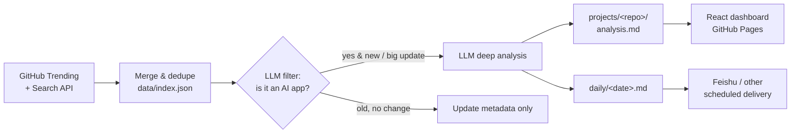

<div align="center">

# 🤖 AI Daily Digest

**A self-hosted intelligence pipeline for trending GitHub AI projects** — automatically discovers hot AI apps, analyzes them in depth with an LLM, archives them, and pushes a concise daily digest every morning.

[](./LICENSE)
[](https://github.com/StevenSixon/my-daily-news/actions/workflows/ci.yml)
[](https://stevensixon.github.io/my-daily-news/)
[](https://www.python.org/)

[简体中文](./README.zh-CN.md) · **English**

[📺 Live Dashboard](https://stevensixon.github.io/my-daily-news/) · [🏗️ How it works](#️-how-it-works) · [🚀 Quick start](#-quick-start) · [🗺️ Roadmap](#️-roadmap)

</div>

---

## The problem

Dozens of AI / Agent projects blow up on GitHub every day, but you don't have time to read every README, scan every release, and decide what's actually worth a look.

**This tool does it for you.** On a schedule it scans GitHub Trending + Search, uses an LLM to filter for genuine "AI apps", does a medium-depth study of each new project, archives a structured report locally, and pushes the day's highlights to your phone. File-based storage, pluggable models, one-command self-hosting.

> For: developers, technical teams, and research analysts who want to stay on top of the AI ecosystem without drowning in it.

## ✨ Features

- 🔍 **Dual sources** — GitHub Trending + Search API, merged and deduped, then LLM-filtered down to real "AI apps"
- 🧠 **LLM deep-dive** — reads each new project's README + key docs + releases and produces a structured analysis report
- 🗂️ **Project library vs. daily** — `projects/` (per-project, date-independent, iterated over time) + `daily/` (the day's highlights)
- 🔌 **Pluggable models** — Anthropic / OpenAI / Gemini / DeepSeek / OpenAI-compatible / Ollama; switch with one config line, with failover support
- ♻️ **Smart revisits** — when an old project trends again, it's only re-studied if there's a new release or a big star jump; otherwise just metadata is refreshed, saving tokens
- 📊 **Live dashboard** — a React + Tailwind board auto-published to GitHub Pages ([Live Demo](https://stevensixon.github.io/my-daily-news/))
- 📤 **Pluggable delivery** — ships with a scheduled Feishu (Lark) bot DM; the channel is decoupled, so PRs for Telegram / Slack / Discord / email are welcome

## 🎬 Sample output

Each day produces a `daily/<date>.md` that's tidy and readable as-is:

```markdown
# 🤖 AI Daily Digest · 2026-06-19

5 AI app projects today.

## 1. withastro/flue 🆕
> A complete TypeScript sandbox runtime for autonomous agents — not an SDK,
> but a next-gen agent architecture.

- 💡 Why look: solves tasks bare LLM calls can't, giving agents a sandbox +
  tools + skills + durable execution harness. For anyone building a
  Claude-Code-grade autonomous agent.
- 🏷️ agent-framework · sandbox-runtime · TypeScript · workflow-automation
- Language: TypeScript ｜ ⭐ 5714 (+305)
- Full report: projects/withastro__flue/analysis.md
```

Every project also accumulates a full `analysis.md` deep report under `projects/<owner>__<repo>/` for when you want to go deeper.

## 🏗️ How it works

> **Design principle:** collection and delivery are deterministic scripts (reliable, cheap); only the "study" step calls the LLM. Don't make the LLM do scraping or message-sending — it's expensive and flaky.



## 📁 Layout

```
projects/<owner__repo>/   # project library: metadata.json / analysis.md / quickstart.md / history.md / README.snapshot.md
daily/<date>.md|.json     # daily digest (json is consumed by the push step)
data/index.json           # global index + dedupe + revisit decisions
dashboard/                # React + Tailwind board, bundled into a single bundle.html
src/                      # Python pipeline
config/config.yaml        # config (focus scope, top_n, llm, delivery)
deploy/                   # launchd plist + run.sh
```

## 🚀 Quick start

```bash
# 1) Dependencies
python3 -m venv .venv && source .venv/bin/activate
pip install -r requirements.txt

# 2) Configure secrets
cp .env.example .env      # fill in GITHUB_TOKEN / your provider's LLM key / (optional) FEISHU_*

# 3) Run the full pipeline once (collect + study + daily report)
python -m src.pipeline

# 4) (optional) Push today's digest to Feishu
python -m src.push

# Debug a single stage
python -m src.collect          # just inspect what was collected

# Weekly trend report (aggregates historical metadata: hottest / longest-running / newcomers; --push to deliver)
python -m src.trend --days 7 --push
```

> Works without Feishu: the pipeline still produces the `daily/` digest and the dashboard — delivery is just an optional last step.

## ⚙️ Configuration (`config/config.yaml`)

- `focus.search_topics` / `min_stars` — focus scope; change here to expand categories later
- `collect.top_n` — max projects to deep-study per day (default 5)
- `llm.provider` / `llm.model` — switch models by editing just these two lines; keys live in `.env`
- `analyze_revisit` — when to re-study an old project

### Required / optional secrets (`.env`)

| Variable | Required | Notes |
|---|---|---|
| `GITHUB_TOKEN` | ✅ | GitHub PAT (public read-only is enough) |
| your provider's key | ✅ | e.g. `ANTHROPIC_API_KEY` / `DEEPSEEK_API_KEY` … |
| `FEISHU_APP_ID` / `FEISHU_APP_SECRET` | for push | Feishu custom app |
| `FEISHU_RECEIVE_ID` / `FEISHU_RECEIVE_ID_TYPE` | for push | target: `open_id` (ou_...) or email/mobile |

> In the Feishu console enable `im:message` and `im:message:send_as_bot` (add `contact:user.base:readonly` if you locate the user by email/mobile), then **publish an app version**.

## 🤖 Self-hosting / scheduling

### Option A: launchd (macOS, an always-on local Mac)

```bash
# 1) Replace the PROJECT_DIR placeholder in the plists with this repo's absolute path
PROJECT_DIR="$(pwd)"
for f in pipeline push weekly; do
  sed "s#PROJECT_DIR#${PROJECT_DIR}#g" deploy/com.daily-news.$f.plist \
    > ~/Library/LaunchAgents/com.daily-news.$f.plist
done
chmod +x deploy/run.sh

# 2) Load
for f in pipeline push weekly; do
  launchctl load ~/Library/LaunchAgents/com.daily-news.$f.plist
done
```

- 06:30 runs the pipeline, 08:00 pushes (staggered for punctuality); Monday 08:30 sends the weekly trend
- ⚠️ Sleep delays triggers; keep the Mac awake / plugged in

### Option B: GitHub Actions (no always-on machine — recommended)

The repo ships [`.github/workflows/daily-pipeline.yml`](.github/workflows/daily-pipeline.yml): it runs the pipeline on a schedule, commits `daily/` + `projects/` back, and optionally pushes to Feishu. Three steps to enable:

1. Settings → Secrets → add `GH_PAT` and your provider's LLM key (e.g. `ANTHROPIC_API_KEY`); add `FEISHU_*` too if you want delivery
2. Settings → Actions → Workflow permissions → **Read and write**
3. Defaults to 06:30 Asia/Shanghai; cron is in UTC, so adjust for your timezone

> You can also use a plain server cron calling `python -m src.pipeline` / `python -m src.push`.

## 🗺️ Roadmap

- [x] M1 closed loop → M2 dual source + project library → M3 deep reports + daily digest → M4 automation + smart revisits
- [x] GitHub Actions self-hosting / scheduling template ([`daily-pipeline.yml`](.github/workflows/daily-pipeline.yml))
- [ ] More delivery channels (Telegram / Slack / Discord / email)
- [ ] Extensible to non-AI categories (config switch already reserved in the architecture)

Full design doc: [`docs/DESIGN.md`](docs/DESIGN.md).

## 🤝 Contributing

PRs and issues welcome! New delivery channels, data sources, and LLM providers are great entry points. Start with [CONTRIBUTING.md](CONTRIBUTING.md) (local setup + conventions) and [SECURITY.md](SECURITY.md) — **this is a public repo; never commit any key or token.**

## 📄 License

[MIT](./LICENSE) © Steven
