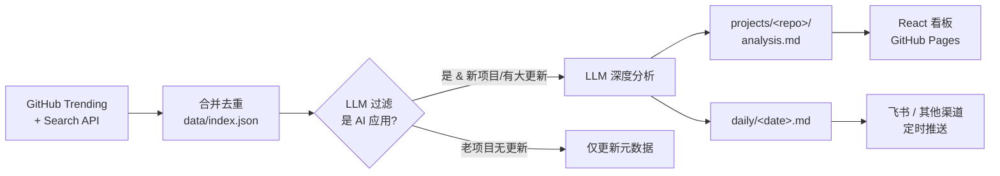

<div align="center">

# 🤖 AI 项目日报助理

**自托管的 GitHub AI 项目情报流水线** — 自动发现爆火的 AI 应用项目，用 LLM 深度分析、归档，每天早上推送一份精炼日报。

[](./LICENSE)
[](https://github.com/StevenSixon/my-daily-news/actions/workflows/ci.yml)
[](https://stevensixon.github.io/my-daily-news/)
[](https://www.python.org/)

**简体中文** · [English](./README.en.md)

[📺 在线看板 Demo](https://stevensixon.github.io/my-daily-news/) · [🏗️ 架构](#️-工作原理) · [🚀 快速开始](#-快速开始) · [🗺️ Roadmap](#️-roadmap)

</div>

---

## 痛点

每天有几十个 AI / Agent 项目在 GitHub 爆火，但你没时间逐个翻 README、读 release、判断"值不值得看"。

**这个工具替你做这件事**：每天定时扫描 GitHub Trending + Search，用 LLM 过滤出真正的「AI 应用」，对新项目做中档深度学习，产出结构化报告归档到本地，再把当天精华推送到你手机。纯文件存储、多模型可插拔、一键自托管。

> 适合：想持续跟进 AI 生态又不想被信息淹没的开发者 / 技术团队 / 投资研究。

## ✨ 特性

- 🔍 **双数据源**：GitHub Trending + Search API，合并去重，LLM 过滤出「AI 应用」类项目
- 🧠 **LLM 深度分析**：对每个新项目读 README + 关键文档 + release，产出结构化分析报告
- 🗂️ **项目库 / 日报分离**：`projects/`（按项目持续迭代，与日期无关）+ `daily/`（按天的精华）
- 🔌 **多模型可插拔**：Anthropic / OpenAI / Gemini / DeepSeek / OpenAI 兼容 / Ollama，改一行配置即切换，支持失败降级
- ♻️ **复访迭代**：老项目再上榜时，只有新 release / star 大涨才重学，否则只更新元数据，省 token
- 📊 **在线看板**：React + Tailwind 看板自动发布到 GitHub Pages（[Live Demo](https://stevensixon.github.io/my-daily-news/)）
- 📤 **可插拔推送**：当前内置飞书机器人定时私聊；渠道是解耦的，欢迎 PR Telegram / Slack / Discord / 邮件

## 🎬 输出样例

每天生成一份 `daily/<date>.md`，排版精简、可直接阅读：

```markdown
# 🤖 AI 项目日报 · 2026-06-19

今日命中 5 个 AI 应用项目。

## 1. withastro/flue 🆕
> 为自主 Agent 提供完备的 TypeScript 沙箱运行时，非 SDK，而是下一代 Agent 架构。

- 💡 值得看：解决裸调 LLM 无法胜任的自主任务问题，为 Agent 提供沙箱、
  工具、技能、持久执行一体的 harness，适合想构建 Claude Code 级自主 Agent 的开发者。
- 🏷️ Agent框架 · 沙箱运行时 · TypeScript · 工作流自动化
- 语言：TypeScript ｜ ⭐ 5714 (+305)
- 深度报告：projects/withastro__flue/analysis.md
```

每个项目还会在 `projects/<owner>__<repo>/` 下沉淀一份完整的 `analysis.md` 深度报告，供按需深入。

## 🏗️ 工作原理

> **设计原则**：采集、推送 = 确定性脚本（可靠、便宜）；只有「学习」这一步调用大模型。不让 LLM 去干抓取、发消息这类脏活——既贵又不稳。



## 📁 目录结构

```
projects/<owner__repo>/   # 项目库：metadata.json / analysis.md / quickstart.md / history.md / README.snapshot.md
daily/<date>.md|.json     # 日报（json 供推送用）
data/index.json           # 全局索引 + 去重 + 复访判定
dashboard/                # React + Tailwind 看板，打包成单文件 bundle.html
src/                      # Python 流水线
config/config.yaml        # 配置（关注范围、top_n、llm、推送）
deploy/                   # launchd plist + run.sh
```

## 🚀 快速开始

```bash
# 1) 依赖
python3 -m venv .venv && source .venv/bin/activate
pip install -r requirements.txt

# 2) 配置密钥
cp .env.example .env      # 填入 GITHUB_TOKEN / 选定 provider 的 LLM key /（可选）FEISHU_*

# 3) 跑一次完整流水线（采集 + 学习 + 生成日报）
python -m src.pipeline

# 4)（可选）推送当天日报到飞书
python -m src.push

# 单独调试某一步
python -m src.collect          # 只看采集结果

# 周趋势报告（聚合历史 metadata，本周最热/持续上榜/新晋；--push 推送）
python -m src.trend --days 7 --push
```

> 不配飞书也能用：流水线照常产出 `daily/` 日报和看板，推送只是可选的最后一步。

## ⚙️ 配置要点（`config/config.yaml`）

- `focus.search_topics` / `min_stars`：关注范围，未来扩展类目改这里
- `collect.top_n`：每天最多深度学习的项目数（默认 5）
- `llm.provider` / `llm.model`：换模型只改这两行；密钥放 `.env`
- `analyze_revisit`：老项目何时重学

### 必填 / 可选密钥（`.env`）

| 变量 | 必填 | 说明 |
|---|---|---|
| `GITHUB_TOKEN` | ✅ | GitHub PAT（只读 public 即可） |
| 选定 provider 的 key | ✅ | 如 `ANTHROPIC_API_KEY` / `DEEPSEEK_API_KEY` … |
| `FEISHU_APP_ID` / `FEISHU_APP_SECRET` | 推送时 | 飞书自建应用 |
| `FEISHU_RECEIVE_ID` / `FEISHU_RECEIVE_ID_TYPE` | 推送时 | 推送目标：`open_id`(ou_...) 或 email/mobile |

> 飞书后台需开启权限 `im:message`、`im:message:send_as_bot`（用邮箱/手机定位再加 `contact:user.base:readonly`）并**发布应用版本**。

## 🤖 自托管 / 定时

### 方案 A：launchd（macOS，常开机的本地 Mac）

```bash
# 1) 把 plist 里的 PROJECT_DIR 占位符替换为本项目绝对路径
PROJECT_DIR="$(pwd)"
for f in pipeline push weekly; do
  sed "s#PROJECT_DIR#${PROJECT_DIR}#g" deploy/com.daily-news.$f.plist \
    > ~/Library/LaunchAgents/com.daily-news.$f.plist
done
chmod +x deploy/run.sh

# 2) 加载
for f in pipeline push weekly; do
  launchctl load ~/Library/LaunchAgents/com.daily-news.$f.plist
done
```

- 06:30 跑流水线、08:00 推送（错峰，保证准时）；周一 08:30 推周趋势
- ⚠️ Mac 睡眠会延迟触发；需保持唤醒/插电

### 方案 B：GitHub Actions（无需常开机，推荐）

仓库已内置 [`.github/workflows/daily-pipeline.yml`](.github/workflows/daily-pipeline.yml)：定时跑流水线 → 回写 `daily/`、`projects/` → 可选推送飞书。开启只需三步：

1. Settings → Secrets → 添加 `GH_PAT` 和你 provider 的 LLM key（如 `ANTHROPIC_API_KEY`）；想推飞书再加 `FEISHU_*`
2. Settings → Actions → Workflow permissions 设为 **Read and write**
3. 默认每天 06:30（北京时间）触发，cron 用 UTC，按需改时区

> 也可换成服务器 cron，直接调 `python -m src.pipeline` / `python -m src.push`。

## 🗺️ Roadmap

- [x] M1 闭环 → M2 双源 + 项目库 → M3 深度报告 + 日报 → M4 自动化 + 复访迭代
- [x] GitHub Actions 定时自托管模板（[`daily-pipeline.yml`](.github/workflows/daily-pipeline.yml)）
- [ ] 更多推送渠道（Telegram / Slack / Discord / 邮件）
- [ ] 可扩展到非 AI 类目（架构已预留 config 切换）

完整设计见 [`docs/DESIGN.md`](docs/DESIGN.md)。

## 🤝 贡献

欢迎 PR / Issue！新增推送渠道、数据源、LLM provider 都是很好的切入点。开始前请阅读 [CONTRIBUTING.md](CONTRIBUTING.md)（含本地搭建与开发约定）与 [SECURITY.md](SECURITY.md)——**本仓库公开，切勿提交任何密钥 / token**。

## 📄 License

[MIT](./LICENSE) © Steven
